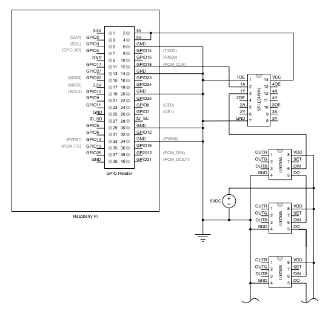

# Xmas Tree Lights

A Raspberry Pi with single-addressable RGB LEDs for my Christmas tree.

## Why?

A few years ago, while staring at a broken strand of conventional
Christmas tree lights and thinking about planning a search
for the one broken bulb, I wondered why we were still
lighting trees using simple incandescent lamps.

Because, you know, the computer age and all?

Now, of course, proper LED-based lights have been available for a while, 
but they were surprisingly simplistic. I wanted programmable lights!

Which brings us here.

## Google to the rescue

This project is based off of the following very helpful web page
from [adafruit.com](https://adafruit.com)

  *  https://learn.adafruit.com/neopixels-on-raspberry-pi

Jump over there for some really cool projects.

## Design

This is the design from the link above, redrawn as a schematic,
and inserted here to give this project some badly needed 
legitimacy. It doesn't really work, because the circuit is
very simple. It looks pretty though, and I could use the practice.



The LEDs require a lot of power, and so I've connected an external
5V DC power supply. The Raspberry Pi's PCM CLK signal is 3.3V, so
something is needed to convert the level to the 5V needed by the 
LED driver chips.

## Hardware

Here is a source for the lights I used. A strand of 50 sounds
like plenty, but each pair of bulbs is separated by just a few inches,
and so one strand covers very little area. I bought two and tied
them together in series.

 * https://www.amazon.com/gp/product/B00B4UKG2W 50pcs DC5V 12mm Diffused Digital RGB LED Pixels Lights

The other stuff is pretty generic. Choose your favorite models
and suppliers:

 * https://www.amazon.com/gp/product/B01D92SSX6 Vilros Raspberry Pi 3 Kit 
 * https://www.amazon.com/gp/product/B00XW2L39K 74AHCT125 Quad level converter
 * https://www.amazon.com/gp/product/B01HYXAG04 SMAKN® AC 100-240V DC 5V 10A 50W power adapter

## Software

To use the simple Python scripts included here, you'll need the rpi_ws281x module. My copy
of this code is included, but you probably want to go to the source.

 * https://github.com/jgarff/rpi_ws281x

## Compatibility

Sound interferes with the LED controller and should be turned off
```
echo "blacklist snd_bcm2835" > /etc/modprobe.d/raspi-blacklist.conf
```

## Automation

I used [zdaemon](https://pypi.org/project/zdaemon/) to wrap a Python script
as a service on the Raspberry Pi. The Python script ```xmastree.py``` that 
implements this service 
is hard coded to turn off the lights between midnight and 7 AM.
